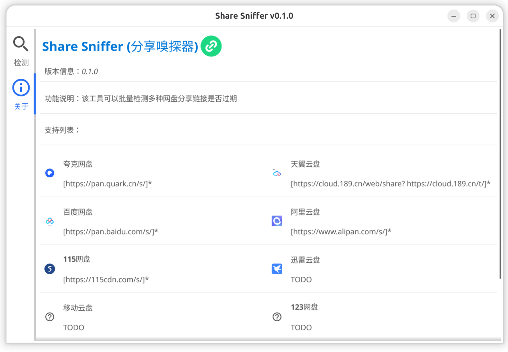
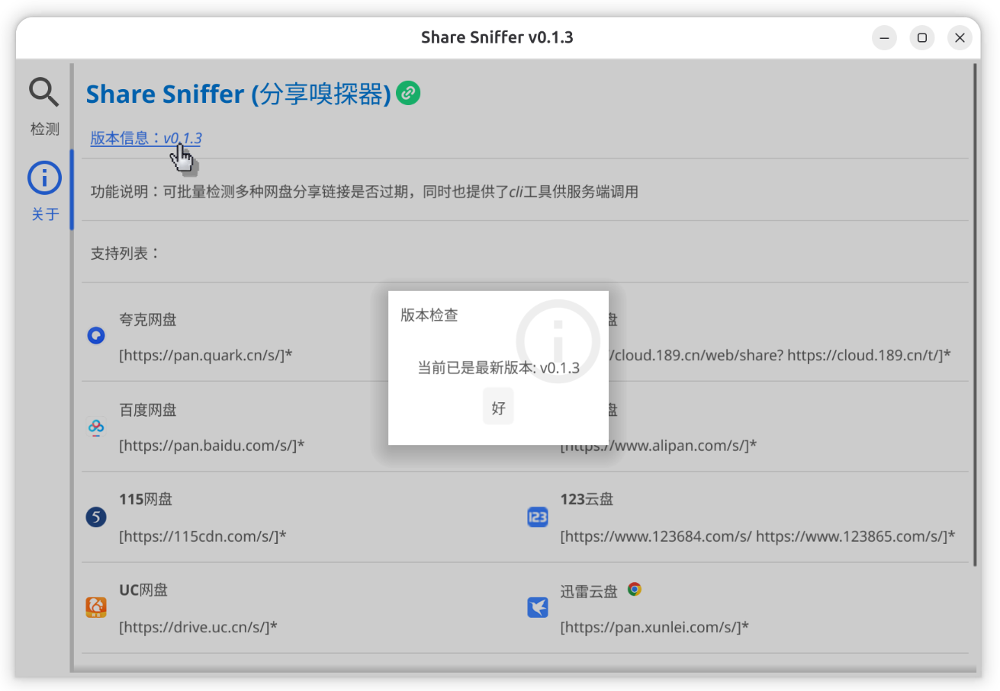
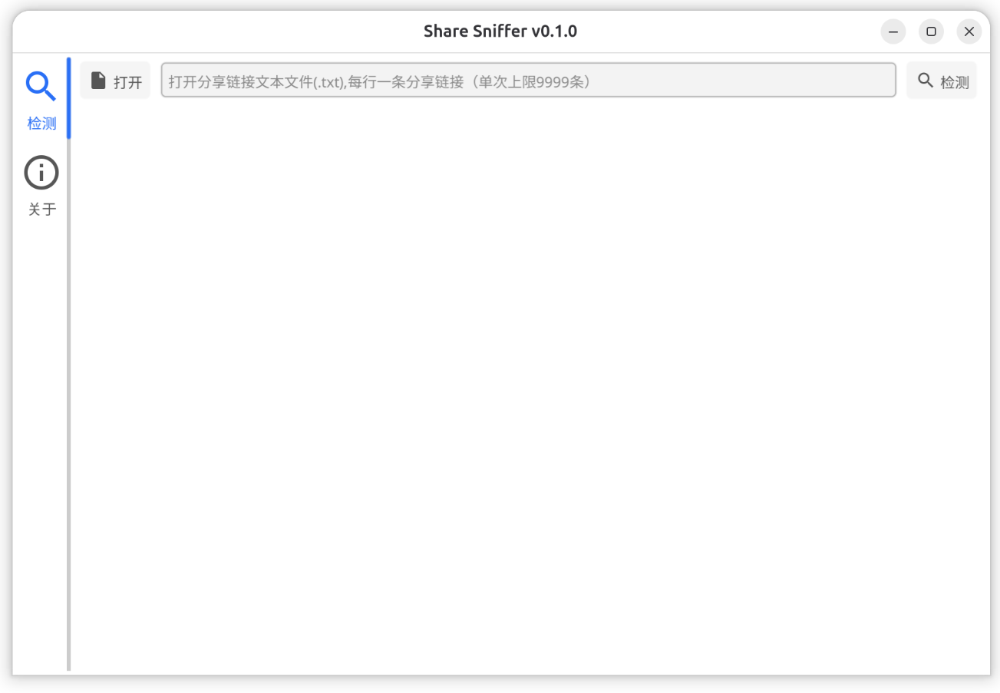
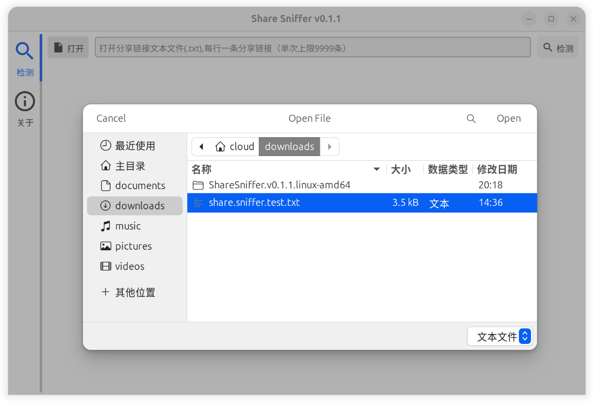
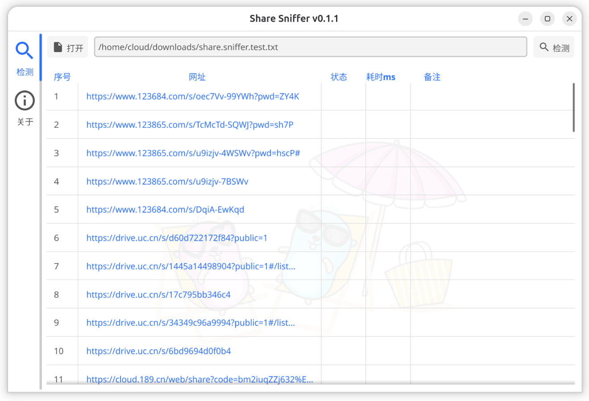
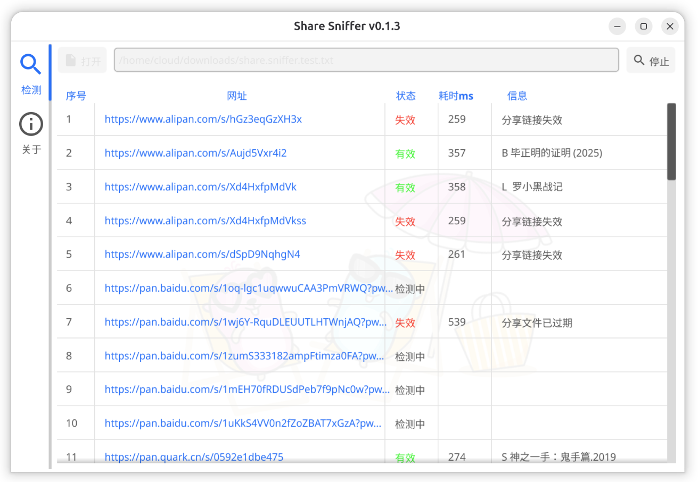
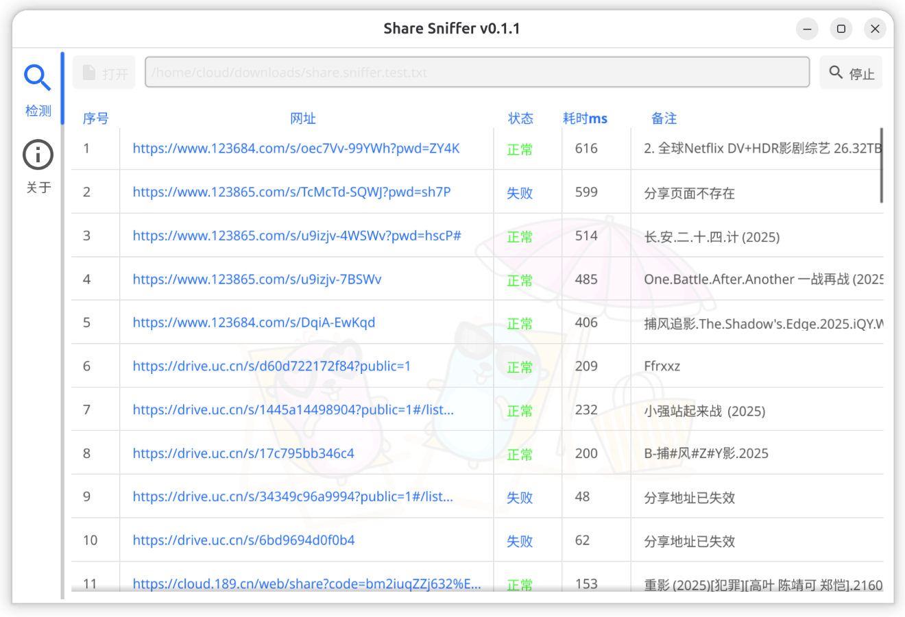

# Share Sniffer（シェアスニッファー）

[English](./README_en.md) | [中文](./README.md) | 日本語


## 1、紹介

Share Sniffer（シェアスニッファー）は、クロスプラットフォームのクラウドストレージ共有リンク検出ツールで、複数の主流クラウドストレージの共有リンク有効性を検出します。このツールは直感的なグラフィカルインターフェース（GUI）と便利なコマンドラインインターフェース（CLI）を提供し、ユーザーはニーズに応じて使用方法を選択できます。

### 1.1 サポートされているクラウドストレージタイプ

- ✅ クォーククラウド
- ✅ 天翼クラウド
- ✅ 百度クラウド
- ✅ アリババクラウド
- ✅ 115クラウド
- ✅ 123クラウド
- ✅ UCクラウド
- ✅ 荀雷クラウドドライブ
- ✅ 139クラウド

## 2、起源

ある映画・TVリソース共有グループには、数千の映画・TVリソース共有リンクが含まれるオンラインスプレッドシートがありました。しかし、これらの共有リンクは時々期限切れになり、手動でチェックするのが遅いため、このツールが開発されました。自動検出により、有効な共有リンクを迅速にフィルタリングし、リソース管理効率を向上させます。

## 3、技術スタック

- **開発言語**：Go 1.25
- **GUIフレームワーク**：[fyne.io/fyne/v2](https://fyne.io/) - クロスプラットフォームGUIフレームワーク
- **CLIフレームワーク**：[github.com/spf13/cobra](https://github.com/spf13/cobra) - コマンドラインフレームワーク


## 4、開発と実行

### 4.1 GUIモード

#### 4.1.1 直接実行

```bash
# 依存関係を初期化
go mod tidy

# GUIアプリケーションを実行
go run ./launcher/gui/main.go

# GUI アプリケーションを実行し、コンパイルおよびリンク プロセス中に実行されたすべての詳細なコマンドを出力します。
go clean -cache  && go clean -modcache && go run -x ./launcher/gui/main.go

```

#### 4.1.2 開発モード

```bash
# fyne開発ツールをインストール（オプション）
go install fyne.io/tools/cmd/fyne@latest

# fyne開発モードで実行（ホットリロードサポート）
fyne serve -src ./launcher/gui
```

### 4.2 CLIモード

#### 4.2.1 直接実行

```bash
# CLIアプリケーションを実行
go run ./launcher/cli/main.go [コマンド/URL]
```

#### 4.2.2 CLIコマンドの例

```bash
# ヘルプ情報を表示
./share-sniffer-cli --help

# バージョンを確認
./share-sniffer-cli version

# サポートされているリンクタイプを確認
./share-sniffer-cli support

# プロジェクトホームページを確認
./share-sniffer-cli home

# 単一リンクを検出
./share-sniffer-cli "https://pan.quark.cn/s/0a6e84c02020"
```

## 5、パッケージ化とコンパイル

プロジェクトには、`/build`ディレクトリに自動化パッケージ化スクリプトが提供されており、WindowsおよびLinuxプラットフォームのパッケージ化をサポートしています。

### 5.1 パッケージ化スクリプトの説明

| スクリプト名 | プラットフォーム | 説明 |
|---------|------|------|
| `build-gui-windows.ps1` | Windows | WindowsプラットフォームのGUI実行ファイルを構築するためのPowerShellスクリプト |
| `build-gui-linux.sh` | Linux | LinuxプラットフォームのGUIインストールパッケージを構築するためのBashスクリプト |
| `build-android.ps1` | Windows | AndroidプラットフォームのAPKを構築するためのPowerShellスクリプト |
| `build-android.sh` | Linux | AndroidプラットフォームのAPKを構築するためのBashスクリプト |
| `build-cli-windows.ps1` | Windows | WindowsプラットフォームのCLI実行ファイルを構築するためのPowerShellスクリプト |
| `build-cli-linux.sh` | Linux | LinuxプラットフォームのCLI実行ファイルを構築するためのBashスクリプト |
| `build-all.ps1` | Windows | Windowsプラットフォームのすべての実行ファイルを一括構築するためのPowerShellスクリプト |
| `build-all.sh` | Linux | Linuxプラットフォームのすべての実行ファイルを一括構築するためのBashスクリプト |

### 5.2 パッケージ化スクリプトの使用

#### 5.2.1 Windowsプラットフォーム

```powershell
# Windows GUIバージョンを構築
cd build/scripts
.\build-gui-windows.ps1

# Androidバージョンを構築
cd build/scripts
.\build-android.ps1

# CLIツールを構築
cd build/scripts
.\build-cli-windows.ps1

# すべてのWindowsパッケージを一括構築
cd build/scripts
.\build-all.ps1
```

#### 5.2.2 Linuxプラットフォーム

```bash
# Linux GUIバージョンを構築
cd build/scripts
chmod +x *.sh
./build-gui-linux.sh

# Androidバージョンを構築
./build-android.sh

# CLIツールを構築
./build-cli-linux.sh

# すべてのLinuxパッケージを一括構築
./build-all.sh
```

### 5.3 パッケージ化スクリプトの機能

- `internal/config/config.go`からバージョン番号を自動的に読み取る
- `fyne`ツールを自動的に検出してインストールする（未インストールの場合）
- Goキャッシュをクリーンアップし、クリーンなビルド環境を確保する
- 生成されたファイルに自動的に名前を付け、`/build/releases/{version}/`ディレクトリに出力する
- Windows、Linux、Androidプラットフォームをサポートする
- 一括構築スクリプトを提供し、ワンクリックでコンパイルすることができる

## 6、インストールとアンインストール

### 6.1 Linux GUIインストール

1. 最新のインストールパッケージ`ShareSniffer.v0.2.0.linux-amd64.tar.xz`を任意のディレクトリにダウンロードします

2. ファイルを解凍し、ディレクトリに入り、インストールします：

```bash
# インストールディレクトリを作成
mkdir ./ShareSniffer.linux-amd64 

# インストールパッケージを解凍
tar -xJf ./ShareSniffer.v0.2.0.linux-amd64.tar.xz -C ./ShareSniffer.linux-amd64 

# インストールディレクトリに入る
cd ./ShareSniffer.linux-amd64 

# インストールを実行
sudo make install
```

### 6.2 Linux GUIアンインストール

```bash
# インストールディレクトリに入る
cd ./ShareSniffer.linux-amd64 

# アンインストールを実行
sudo make uninstall 

# 親ディレクトリに戻る
cd ../ 

# インストールディレクトリを削除
rm -rf ./ShareSniffer.linux-amd64
```

### 6.3 share-sniffer-cliのインストール

#### 6.3.1 Linuxインストール

```
最新のshare-sniffer-cli.v0.2.0.linux-amd64をダウンロードします
share-sniffer-cliに名前を変更します
実行ファイルを`/usr/local/bin`ディレクトリに移動します
```

#### 6.3.2 Windowsインストール

```
最新のshare-sniffer-cli.v0.2.0.windows-amd64.exeをダウンロードします
share-sniffer-cli.exeに名前を変更します
必要に応じて実行ファイルを`C:\Windows\System32`ディレクトリに移動します
```


## 7、インターフェースプレビュー

### 7.1 アバウトインターフェース

<p align="center">
  
  
</p>

### 7.2 検出インターフェース

<p align="center">
  
  
</p>

<p align="center">
  
  
</p>

### 7.3 結果インターフェース

<p align="center">
  
</p>

## 8、CLIモードツールの紹介

### 8.1 コマンドの説明

| コマンド | 説明 | 例 |
|------|------|------|
| `help` | ヘルプ情報を表示 | `./share-sniffer-cli --help` |
| `version` | バージョン情報を表示 | `./share-sniffer-cli version` |
| `support` | サポートされているリンクタイプを表示 | `./share-sniffer-cli support` |
| `home` | プロジェクトホームページリンクを表示 | `./share-sniffer-cli home` |
| `[URL]` | 指定されたリンクを検出 | `./share-sniffer-cli "https://pan.quark.cn/s/0a6e84c02020"` |

### 8.2 出力形式

CLIツールはJSON形式の結果を返し、他のプログラムから呼び出しやすくなっています：

```json
{
  "error": 0,
  "msg": "valid",
  "data": {
    "url": "https://pan.quark.cn/s/0a6e84c02020",
    "name": "国語アニメ",
    "elapsed": 359
  }
}
```

#### 8.2.1 出力フィールドの説明

| フィールド | タイプ | 説明 |
|------|------|------|
| `error` | int | エラーコード、0 はエラーがないこと、つまりリンクが有効であることを示します。10 は不明なエラーを示します。11 はリンクの有効期限が切れていることを示します。12 はパラメータが正しくないなどを示します。13 はタイムアウトを示します。14 は要求処理中にエラーが発生したことを示します。 |
| `msg` | string | ステータス説明 |
| `data` | object | 検出結果の詳細 |
| `data.url` | string | 検出されたURL |
| `data.name` | string | リソース名（検出が成功した場合） |
| `data.elapsed` | int64 | 検出時間（ミリ秒） |

### 8.3 使用シナリオ

- リンク有効性の一括検出
- 他のスクリプトやプログラムへの統合
- サーバー環境での使用
- 自動検出ワークフロー

## 9、貢献

IssueとPull Requestの送信を歓迎します！

## 10、ライセンス

[GNU GPL v3 License](LICENSE)